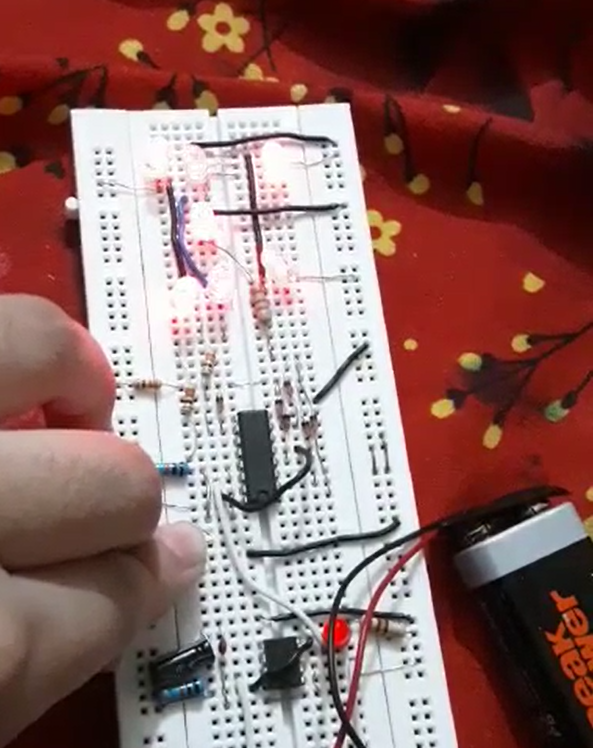

# 🎲 Electronic Dice Project 🎲
**See the vedio here**(VID-20220702-WA0012 file)

Welcome to the **Electronic Dice** project repository! 🎉

Are you tired of using traditional dice that can become biased or deformed over time? Look no further! The Electronic Dice is here to revolutionize your gaming experience. Say goodbye to cheating and hello to fairness with this high-speed, unbiased, and digital alternative to the classic dice.

## Introduction

The **Electronic Dice** project presents a modern solution to the age-old problem of biased dice. Whether you're playing games like Snake and Ladder, Ludo, or any dice-based game, this electronic dice is designed to bring transparency and fun to your gaming sessions.

### Components Used:

- CD4017 IC
- 555 Timer IC
- 2 Resistor - 1k
- Capacitor - 10uF
- Variable Resistor - 10K
- Push Button
- 6 LEDs
- Battery - 9v

## How It Works

### 4017 IC

The heart of the electronic dice is the CD4017 CMOS decade counter chip. It sequentially produces output at its 10 pins (Q0 – Q9). This sequential output is controlled by clock pulses applied to PIN 14. The output progresses with each clock pulse, creating a sequential ON and OFF pattern for the output pins.

### 555 IC

The 555 timer chip is a versatile 8-pin device that operates as a monostable, bistable, or astable multivibrator. In this project, it's used in an astable configuration to generate clock pulses for the 4017 IC. The oscillation frequency of the 555 timer controls the speed of the LED flashing on the dice.

## Usage

1. Press the push button to start the dice.
2. The LEDs will flash rapidly.
3. Release the button to stop the flashing.
4. The illuminated LED will indicate the number rolled on the dice.

## Conclusion

The **Electronic Dice** project offers a modern, unbiased, and fun way to play dice-based games. By combining the power of CD4017 and 555 Timer ICs, we've created a digital dice that guarantees a fair play every time. Say goodbye to cheating and welcome a new era of gaming!

Feel free to explore the circuit diagrams and documentation in the repository. Have fun and happy gaming! 🎮🎲

